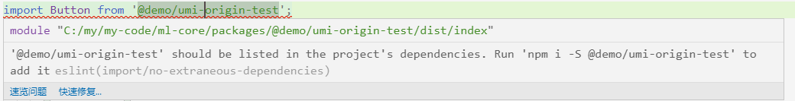

步骤
1. 初始化`lerna.json`
    - npx lerna init --independent  
    > 使用独立版本号  
    > 会自动在`package.json`中增加`lerna`依赖
2. 修改新增`lerna.json`
    ```json
    "packages": ["packages/@demo/*", "packages/components"],
    "npmClient": "yarn",
    "useWorkspaces": true,
    "publishConfig": {
      "access": "public"
    }
    ```
3. 修改根目录`package.json`增加
    ```json
	  "private": true,
	  "workspaces": [
	    "packages/@demo/*",
	    "packages/components"
	  ],
	  "scripts": {
	    "lerna":"lerna" 
	  },
    ```
    > `scripts`使用项目中的`lerna`，而不是全局的，消除两个版本不一致的影响
4. 修改根目录`.fatherrc.js`增加
    只遍历编译`packages`下的文档
    ```javascript
    doc: {
	    src: 'packages/',
    },
    ```
5. **待**执行`yarn install`命令
## 移动原始demo
我们看到项目`src`中还有原来`create-umi`创建的`demo`，我们将他移动到`packages`中
1. 在`packages`创建文件夹`packages/@demo/umi-origin-test`
    > 稍后我们会在`@demo`这个文件夹下创建其他包  
    > 以`@`开头建立`packages`的次级文件夹是因为这样更符合依赖包创作开发规范，很多工具都以这种规范开发  
    > `umi/father`如果不指定包的路径，对于次级文件夹只能识别`@`开头的：[说明](./umi-father.md)
2. 移动文件`git mv src packages/@demo/umi-origin-test/src`
3. 创建`package.json`（注意校验文档格式）
    ```json
    {
	  "name": "@demo/umi-origin-test",
	  "version": "0.0.0",
	  "private": true, // demo包我们选择不发布
	  "main": "dist/index.js",
	  "module": "dist/index.esm.js",
	  "peerDependencies": {
	    "react": "16.x"
	  },
	  "files": [
	      "dist"
	    ]
	  }
    ```
4. 处理`ts`问题
    由于一些原因，这些子项目读取不了`ts`的配置文件，如果是`ts`组件就需要手动处理`ts`配置文件  
    复制根目录的`tsconfig.json`到这里  
    新建`typing.d.ts`如下
    ```typescript
    import '../../../typings';//路径看实际路径
    ```
5. 此时可以运行`yarn`安装试一试，运行完成之后，可以发现`node_modules`中多了我们创建的包

6. 运行`yarn dev`就可以看到界面了
    > 警告：我们还没有打包这个组件，所以里面没有`dist`文件夹，其他项目引用会报错。
## 自己创建一个demo包
1. `packages/@demo/my-test/package.json`
    ```json
    {
      "name": "@demo/my-test",
      "version": "0.0.0",
      "private": true,
      "main": "dist/index.js",
      "module": "dist/index.esm.js",
      "peerDependencies": {
          "react":"16.x"
      }
    }
    ```
2. `packages/@demo/my-test/src/index.jsx`
    ```javascript
    import React from 'react';
    import Button from '@demo/umi-origin-test';
    export default function(props) {
      return (
        <div>
          {props.label}：<Button>my-test</Button>
        </div>
      );
    }
    ```
    > 这一步会提示不能解析`@demo/umi-origin-test`，因为它还没打包。第四步我们处理这个报错
3. `packages/@demo/my-test/src/index.mdx`
    ```md
    ---
    name: my-test
    route: /@test/my-test
    ---
    import MyTest from './'
    ## 展示
    <MyTest label='包装' />
    ```
4. 处理不能解析`@demo/umi-origin-test`问题
	我们运行两次`yarn build`来打包。为什么运行两次？看[多包打包问题](./umi-father.md/#多包打包问题)
5. 在运行`yarn`安装（记得每次增加`package`后都要运行），运行`yarn dev`查看
    > 此时虽然可以运行，但是依然有警告，下一步修复
    

6. 上面的警告我们需要添加`@demo/umi-origin-test`到依赖 [文档](./yarn-workspace.md)
    ```shell
    yarn lerna add @demo/umi-origin-test --scope=@demo/my-test 
    ```
    
## 创建components
不知道你有没有注意，在`lerna.json`中有配置`components`，通常在这里开发自己的组件库，也是为了演示docz的配置。注：`umi`官方已经放弃docz维护，全力开发[father-doc](https://github.com/umijs/father-doc)
1. 创建一个`components`包，自行查看项目代码
2. 安装`docz`主题，默认的`docz-them-umi`有`bug`，换其他主题
    ```shell
    yarn add docz-theme-ztopia -D -W
    ```
3. 配置docz
    - 修改主题
    - 修改开发端口
    - 修改打包目录
    - 修改页面标题
    - 配置菜单  
	  最后如下：
```js
{
  menu:[
    { name: '前言', route: '/' },
    {
      name: '示例',
      menu: [
        {name: 'umi-origin-test',},
        {name: 'my-test',},
      ],
    },
    {
      name: '组件库',
      menu: [
        {name: '前言',route: '/@ml/rc',	},
      ],
    },
  ],
  theme: 'docz-theme-ztopia',
  typescript: true,
  src: 'packages/',
  port: 2000,
  dest: 'dist/docs',
  title: '单体式仓库',
}
```
4. 根`packages/index.mdx`
```md
---
name: 前言
route: /
---
单体式开发框架
```
5. 修改包的`mdx`配置，自行查看项目代码
	
## 包的基本结构
创建包的方式是很多，可以使用`lerna create`创建，也可以使用`umi-cli`创建，也可以手动创建，但都必须满足以下要求
1. `package.json`满足
```
{
  "name": "@demo/my-test",//必须：保证包有一个名称（lerna）
  "version": "0.0.0", // 必须：保证包有一个版本号（lerna）
  "private": true,// 如果项目不想发布就设置为true
  "main": "dist/index.js",// 必须：为这个（umi/father配置而定）
  "module": "dist/index.esm.js",//必须：为这个（同上）
  "peerDependencies": {//必须：有这个react前置（同上）
    "react": "16.x"
  },
  "files": [
    "dist"// 如果要发布，则推荐只发布dist
  ]
}
```
	
2. 以`src/index.js`为入口  
  必须：以`src/index.js`为入口，因为`umi/father`默认以包中的`src/index`为入口，且由于我们是多包，不便于设置`father`的`entry`
3. 文档最好放在`src`目录下
> ts版
注意包中一定要有`tsconfing.json`和`typing.d.ts`，[issues](https://github.com/umijs/father/issues/163)
